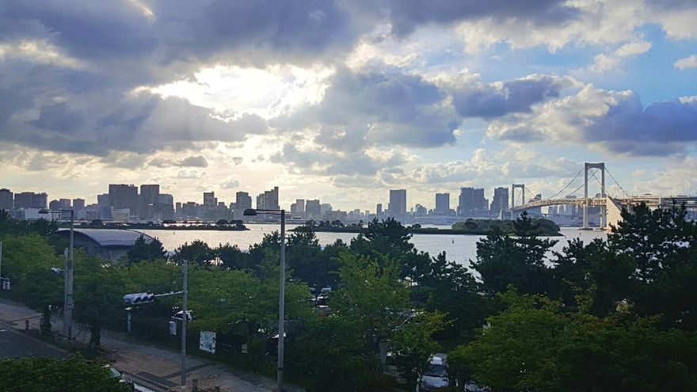
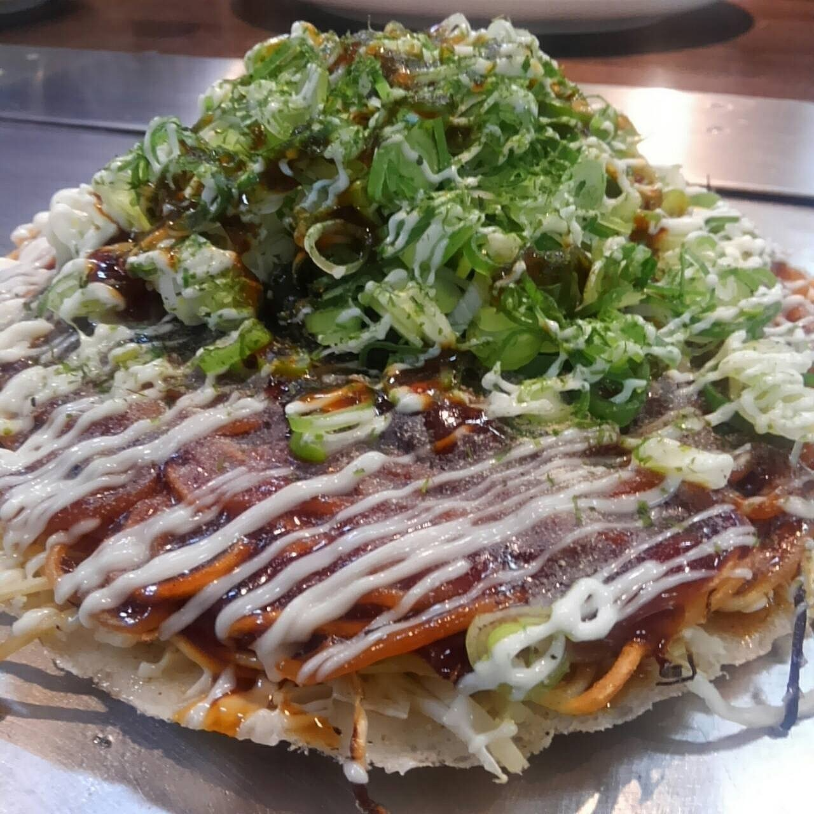
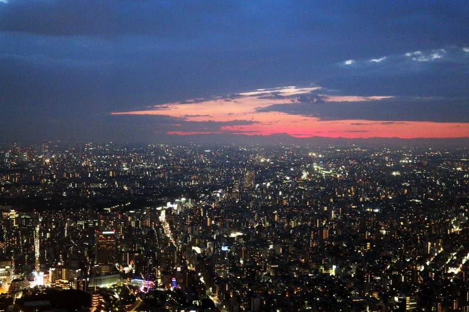

# 나의 여행 계획 짜기

학교 일본어 시간 수행평가로 "내가 가고 싶은, 떠나고 싶은 여행 계획 짜기"가 나왔다.  
평소에 해외 여행이 무척이나 가고 싶은 나머지 쉴틈이 날때마다 여행 계획을 짜는 나로서, 정말 좋은 수행평가가 아닌가.

이번 기회에 예전 기억들을 되살려 정말 멋들어지는 계획을 한번 짜보려한다.

~~근데 내가 짠다 하면 일본 여행 밖에 없는데, 시국이 이런 상황에 일본 여행 계획을 짜도 되는걸까~~

## "東京(とうきょう)"


> 낮에 볼 수 있는 도쿄의 화사한 색감의 건물들


> 밤에는 낮과 대비되며 색달라지는 도쿄의 모습을 보라  
> 정말 아름답지 않은가?


> **꼭 가보고 싶은 오타쿠들의 성지 아키하바라**


> 어디서 어디까지가 시부야고, 오다이바인지, 신주쿠인지 잘 모르는 사람들을 위하여 미리 핀을 찍어놓은 지도이다  
> 실제로 여행할때 꽤 도움이 많이 된다고 한다

**도쿄**(東京とうきょう)는 일본의 혼슈 동부에 있는, 메이지 시대 이후 사실상 일본의 수도이자 최대 도시이다.

행정 구역 상으로는 도쿄도에 속하지만, 도쿄도는 다마 지역이나 이즈 제도, 오가사와라 제도의 넓은 지역을 포함하고 있어,  
도시라는 뜻의 "도쿄"와는 그 의미가 조금 다르다.  
도쿄에는 일본 각 정부 부처, 천황이 기거하는 고쿄 등이 있다. 

도쿄는 세계에서 제조업이 가장 발달한 도시이다.   
또한 수많은 다국적 기업들이 도쿄에 본사 또는 지사를 두고 있으며, 세계의  

* 게임 산업

* 만화 산업

* 애니메이션 산업

* 영상 산업

* 디지털 사업

* 첨단산업

등의 중심지이다.  
도쿄는 세계 최대의 지하철 교통망을 가지고 있으며, 세계에서 가장 큰 도시 광역권을 구성한다.  
뉴욕, 런던과 함께 세계 3대 경제 수도로 불린다.

## なぜ! 東京を選んだのか / 왜 도쿄를 선택하였는가

### 개인적 취미와 흥미


> 오다이바 Round 1 오락실 앞에서 볼 수 있는 매우 큰 건담  
> 시기마다 기체의 종류가 변경된다고 한다  
> ~~밤에는 빛도 반짝반짝 난다고!~~



> 이 아름다운 전경을 보시라  
> 마치, 하늘에서 신이 우리를 향해 손짓하는 것 같지 아니한가?

평소에, 일본 여행에 대해 나는 굉장히 많은 환상을 가지고 있다.  
사람 사는게 어디든 다 힘들다는 걸 잘 알지만, 도쿄에서만큼은 늘 편하고 웃음꽃 만개하며 하고 싶은 일을 할 것 같은.

일본 드라마나 예능, 유튜브 영상과 트위터 등을 보면서 정말 아름다운 장소이며 내가 하고 싶었던 거의 대부분의 것들이 존재하는 장소.

늘 꿈꿔왔던, *이상의 장소*인 것이다

> 지금까지 보아왔던 애니메이션 대부분의 주인공들이 도쿄에서 활동하거나 가고 싶다는 의사를 밝혀왔고, 이것들이 나에게 영향을 끼친게 아닐까라는 생각을 해본다

-----

#### 난 아케이드 리듬게임을 좋아한다!

어릴적 아버지 손에 이끌려 우연히 오락실에 들어가게 된 초등학생 2학년 때의 나는,  
그때 접했던 EZ2DJ 라는 리듬게임을 접하게 되었고 이것이 나의 리듬게임 생활의 촉매가 되어버렸다

흥돋는, 즐거운, 쓸쓸한, 슬픈, 웃긴, 재미있는 다양한 음악들과 이에 맞추어 경쾌하게 눌러 느끼는 버튼의 타격감, 마치 DJ가 된듯한 스크래치의 쫀득쫀득함이 어린 날 매료시켜버렸고,  
이 날 이후로 난 아케이드 리듬게임의 단골 손님이 되어버렸다

세상에 수없이 많이 존재하는 아케이드 리듬게임들 가운데 내 욕구를 충족시켜줄만한 퀄리티를 가진 게임은 대부분 일본에 있었으며, 내가 잘 알지 못하는 더욱 많은 리듬게임이 일본에 있다는 소식을 들은 나는 매우 일본에 가고 싶어졌다


한국에서는 돈과 정치 등의 이슈로 정발되지 못한 아쉬운 리듬게임 츄니즘.  

학교 측 수학여행으로 도쿄를 가게 되었고,  
그때 매일 3판 정도 즐겼던 게임인데 터치스크린의 세밀함과 높낮이 센서가 정말 인상적이었었다

이 게임 하나 때문에 꼭 다시 일본을 들르고 싶을 정도


우리나라와는 대비되게 관리를 잘해 깔끔하며 버튼의 압력도 전문가용 공장 장치에 들어가는 것 못지않은 세밀한 느낌을 얻을 수 있는 일본 오락실

정말 남 못지않게 리듬게임에 대한 애정과 열정이 대단하다고 자부할 수 있는 난,  
일본의 유명한 리듬게임 성지인 오락실에 매우 가고 싶어졌다

-----

### 외교적 이슈


현재 우리나라와 일본의 외교가 날이 가면 갈수록 격해지고 있는 가운데, 우리나라 국민들이 외교부 의사에 동참하여 일본을 보이콧하며 "가지 않습니다", "사지 않습니다" 펫말과 함께 일본과 관련된 대부분의 경제활동을 하지 않고 있는 상태이다


이 덕분에 믿을 수 없을만큼 갈수록 매우 떨어지는 비행기 표값


반대로 끊임없이 올라가는 엔화 (2019. 08. 27 현재 미국 - 중국의 갈등에 엔화가 폭등 중)

이를 종합하여 분석해본 결과, 저렴하게 일본 여행을 다녀온다면 좋은 기회가 될 수 있는 상황이다

## 맛집 - 어디어디가 요리를 잘하나

### 히토쓰바시 가쿠엔 라면 - 17대째 철면 고평점


**by ナオキングさん**

```
小平駅南口からあかしあ通りを歩いて約7分のところにある17代目哲麺。近所なので食べたくなると自転車に乗ってフラッと寄ってます。食券機にて注文しますが迷わず「豚骨醤油味玉ラーメン」を選び、席について上着を脱ごうとしてる間に「お待たせしました」と早くもラーメンが登場です。いつ来ても注文から品出しが早い。時間の無いサラリーマンの強い味方間違いなしです。替え玉も+50円とリーズナブル。美味しく頂きました。
```

**by 나오킹씨**

```
고다이라 역 남쪽 출구에서 약 7분정도 거리에 있는 17대째 이어져오고 있는 가게입니다. 근처라서 먹고 싶을때에는 자전거를 타고 들르고 있습니다. 저는 식권기에서 고민하지 않고 바로 "사골간장라면"을 선택합니다. 그 후 자리에 상의를 벗어놓는 중에 "기다리게 했습니다"라며 라면이 등장합니다. 음식 나오는게 정말 빠릅니다. 시간이 없는 샐러리맨에게 강추입니다. 추가도 50엔으로 저렴합니다. 맛있게 먹었습니다.
```

코다이라 역에서 약 도보 7분  
주위에는 아무것도 없는 주택가들 사이에서, 지역 주민을 중심으로 사랑 받아 온 라면 집.

최근에는 그 인기 때문에 멀리서부터 손님이 찾아올 정도이다
카운터 15석의 아늑한 공간이면서도 점심부터에서 저녁까지 늘 많은 인파로 붐빈다

가게에서 맛볼 수 있는 것은, "파 라면" 등의 라면으로부터, "츠키미토로 이모동"이나 "챠한 셋트" 등의 볼륨 만점의 밥까지 다양하다

그 중에서도 특히 추천인 것이 "크리미 사골 바리카타세면" 이다
500엔이라는 저렴한 가격의 장점도 있고, 가늘며 딱딱한 면은 조금 딱딱한 면에서 먹으면 맛이 더욱 놀라우며, 크림과 돼지 등뼈가 농후함이 미각을 자극한다  
50엔으로 면 추가를 할 수 있는 것도 뛰어나다

| 종류 | 내용 |
| --------- | ---------- |
| 店舗名 | 十七代目 哲麺 小平店 |
| 住所 | 東京都小平市仲町422（最寄り駅：小平駅） |
| 営業時間 | 11:00～翌2:00／ 日曜営業 |
| 食事の予算 | ランチタイム予算 ～￥999 ／ ディナータイム予算 ～￥999 |
| 参考サイト | [食べログで詳細を見る・予約する](https://ck.jp.ap.valuecommerce.com/servlet/referral?sid=3294617&pid=885268379&vc_url=https%3A%2F%2Ftabelog.com%2Ftokyo%2FA1328%2FA132804%2F13112679%2F) ※ 最新情報は必ずリンク先をご確認ください。 |

-----

### 와세다 야키도리 - 다노큐 와세다점


**by つむじさん**

```
早稲田駅から徒歩4分ほどの場所にある場所です。夜は居酒屋なのですが、ランチタイムは学生に人気の大盛り店となっています。中でもからあげ丼が美味しく、大盛りも4段階に分かれていて、680円で好きなサイズを選ぶことができお腹を満たすことができます。
```

**by 츠무지상**

```
와세다 역에서 도보 4분 정도 걸리는 곳에 있는 곳입니다. 밤은 선술집이지만, 점심시간은 학생에게 인기있는 대형점이 되고 있습니다. 닭 튀김 덮밥이 정말 맛있으며, 곱배기도 4단계로 나뉘어 680엔으로 좋아하는 사이즈를 골라 적절히 배를 채울 수 있습니다.
```

와세다의 학생이나 현지 주민을 중심으로 인기를 끌고 있는 야키도리의 인기점.  
어느 메뉴도 합리적인 가격으로 식사를 할 수 있다는 점에서 60좌석이 있는 가게 안은 연일 인기로 만석이 지속되고 있다

그런 가게에서 맛볼 수 있는 것와 제대로 튀겨 엄청나게 맛있는 쥬시 가라아게와, 단골이 되기 일수인 "계피폰식초"등의 선술집 메뉴.
풍부한 살이 들어간 "스타메"는 식사의 시메에 인기있는 일품이기도 하다

그 중에서도 추천인 것이 "야키도리"
쥬시로 고기같은 복숭아 고기나, 프리프하고 단맛이 있는 가죽등의 정번물로부터, "하라"나 "리브"등이라고 하는 기름기 많은 단맛을 느낄 수 있는 야키톤 등도 인기의 하나다

| 종류       | 내용                                                         |
| ---------- | ------------------------------------------------------------ |
| 店舗名     | 焼き鳥 田乃休 早稲田店                                       |
| 住所       | 東京都新宿区喜久井町54（最寄り駅：早稲田駅）                 |
| 営業時間   | [月～金] 11：30～14：30 17：00～23：30 [土曜日] 17：00～23：30 [日・祝日] 17：00～23：00 |
| 食事の予算 | ランチタイム予算 ～￥999 ／ ディナータイム予算 ￥1,000～￥1,999 |
| 参考サイト | [食べログで詳細を見る・予約する](https://ck.jp.ap.valuecommerce.com/servlet/referral?sid=3294617&pid=885268379&vc_url=https%3A%2F%2Ftabelog.com%2Ftokyo%2FA1305%2FA130504%2F13006135%2F)※ 最新情報は必ずリンク先をご確認ください。 |

------

### 도립대학 - 오코노미야끼 '뿌리쿠치' 도립대점



**by ゆきにゃむさん**

```
場所が少しわかりづらいのですが都立大学駅から徒歩1分程でアクセスも良いです。広島の府中というところの焼き方のお好み焼きだそうで、麺がカリカリになってるお好み焼きが新鮮で美味しかったです。鉄板で食べられるのも魅力ですよ。お好み焼き以外のメニューも豊富でお子様連れの方も多い印象でした。
```

**by 유코냥상**

```
길이 조금 어렵지만 도립 대학 역에서 도보 1분 정도로 접근이 좋습니다. 히로시마의 후츄라고 하는 곳의 구이 방법을 사용하며, 전 이 방법을 좋아합니다. 철판에서 먹는게 엄청난 매력이에요. 오코노미야끼 외에 다른 메뉴도 풍부합니다. 어린아이도 많은 듯 했습니다.
```

조용한 주택가가 줄선 거리이기도 한 도립 대학 구역  
그런 도내에서도 안정감이 있는 지역에서 인기를 끌고 있는 오코노미야키 전문점이다

점 내에는 큰 철판이 눈앞에 있는 30석으로 퇴근길의 직장인들로부터 아이들의 가족까지 폭넓은 층의 사랑을 받아 온 인기 음식점

가게에서 맛볼 수 있는 오코노미야끼는 **"후츄야끼"** 라고도 불리우는. 히로시마 구이와는 전혀 다른, 다진 고기를 소바 아래에 깔고, 메밀을 바삭바삭하게 될 때까지 구워내는 히로시마안에서도 **"후츄시"** 방면에서 먹을 수 있는 것이 특징이다

인기가 있는 오코노미야키는 후츄야끼
소수지의 아삭한 식감과 콩알의 감칠맛을 토핑하고 있으며, 탱탱한 천과 칼칼한 메밀의 궁합을 듬뿍 담은 소스와 함께 맛볼 수 있다

| 종류       | 내용                                                         |
| ---------- | ------------------------------------------------------------ |
| 店舗名     | ぷくいち 都立大店                                            |
| 住所       | 東京都目黒区平町1-26-6（最寄り駅：都立大学駅）               |
| 営業時間   | 17:00～24:00(L.O.23:30)／ 日曜営業                           |
| 食事の予算 | ディナータイム予算 ￥1,000～￥1,999                          |
| 参考サイト | [食べログで詳細を見る・予約する ](https://ck.jp.ap.valuecommerce.com/servlet/referral?sid=3294617&pid=885268379&vc_url=https%3A%2F%2Ftabelog.com%2Ftokyo%2FA1317%2FA131702%2F13184632%2F)※ 最新情報は必ずリンク先をご確認ください。 |

------

## 관광지 - 놀러와서 하루종일 게임만 할건 아니잖아


도쿄에는 관광 명소가 많은데, 이걸 어느 세월에 다 가볼 것인가?  
꼭 들러봐야 할만한 그런 명소들만 한번 찝어보겠다 (내 기준)

-----

### 도쿄 스카이트리


> 마치 삼성 갤럭시 2의 배경화면 같은 감성이 묻어나지 아니한가



> 노을 감성을 만끽 할 수 있다.  
> 단연컨데, 도쿄에서 **최고의 야경**을 볼 수 있는 곳이다!

스카이트리 위에서 360도로 한번 둘러보면 바깥 경치의 아름다움과 신비로움으로 쏙 빠지게 될 것이다

진짜 애니메이션에서 보던 집들과 사람, 교통시설 등이 보여져서 더욱 신기하다

저녁에 찾아가 야경을 보면 입에서 World Of the Warcraft 를 남발하는 자기 자신을 볼 수 있을 것이다

-----

### 네즈 신사


> 강렬한 붉은 토리이가 인상적이다

붉은 토리이들이 세워져있는 길은 신들이 사용하는 길 같은 기분을 얻을 수 있을 것이다


> ~~마치 이런 느낌이려나~~


> 노점상(?) 도 있다

평소에 품고 있는 소원이나 염원이 많다면 네즈 신사에 가서 한번 빌어보는 건 어떨까

언젠가 생길 여자친구(???) 와 함께 저곳에서 놀아보는 것도 나쁘진 않을 듯

-----

### 자판기


> 아키하바라에서 이런 자판기를 만난다면 무슨 상품이 진열되어있는지 꼭 확인하도록.  
> 예상외의 엄청난 물건이 진열되어있을 수 있다


아키하바라의 명물 '캔 어묵'. 뜨끈따끈한 어묵을 몇 초만에 뽑을 수 있다.  
추운 겨울날 애인에게 실연당했을때나, 그냥 배가 고플때, 속을 데우고 싶을때 등에 좋다


~~몸에 좋은 장수풍뎅이도 단돈 540엔에 뽑아 먹을 수 있다(????)~~

-----

### 씹덕


그렇다. 만인의 욕심과 욕망, 속쇠의 고삐를 힘껏 풀어주며 부모처럼 어루만져주는 그 장소

**아키하바라** 이다!

늘 원했던, 가지고 싶었던, 보고 싶었던, 듣고 싶었던 피규어와 사운드 트랙, 족자봉에 안경닦기 등등 수없이 다양한 물건들로 오타쿠들의 마음을 울리는 장소

한번 가보게 된다면, 왜 오타쿠들이 이토록 열광을 하는지 쉽게 알 수 있을 것이다


> '그 단어' 앞에서는 국경이란 없다.  
> **ㄴㄷㅆ**

사진 자료들 검색하면서 ㄹㅇ 너무 예뻐서 껌뻑 넘어가는 줄 알았다


> 와!!! 렘상!!!!


> 이렇게 도심이 깔끔할 수 있단 말인가


> 한번 들어가면 시간 가는 줄 모르는 마성의 그 장소  
> 우리나라 유튜버 **천대광**과 **딕 헌터**가 메이가카페에 들어가 사냥을 하는 영상이 있다
>
> [https://www.youtube.com/watch?v=m9x48gdORIM](https://www.youtube.com/watch?v=m9x48gdORIM)
>
> 상당히 **잔인**하므로 시청에 유의하도록 하자

#### !!! 중요


환전은 꼭 필수다  
가지고 있는 엔화가 다 떨어졌다면 꼭 환전소에서 돈을 바꿔가도록 하자

카드 만으로는 아무래도 현금에 비해 구매할 수 있는 물건의 정도의 차이가 있다

## 교통수단 - 관광객이 제일 조심해야할 것


움직이게 되는 범위가 상당히 넓기 때문에, 도보로 모든 것을 해결하려면 다리에 무리가 엄청날 것이다  
그래서 대중교통을 이용할 것인데, 일본은 교통을 자율적으로 운영되도록 맡겨놓아 상당히 비싸다

잘 모르고 다니다보면 역 몇개 들렀다 파산하는 자기 자신을 볼 수 있게 될 것이므로,  
어디를 가야 하는가에 대한 플랜이 꼭 필요하다


"Keisei Skyliner & Tokyo Subway Ticket", "스카이라이너 디스카운트 티켓" 등 현재 상황에 알맞는 패스를 구입하고 다니는게 정신건강에 이롭다

## 숙소 - 잠은 좋은 곳에서 자는게 좋잖아요

### 호텔 니와 도쿄


> 이 **환상적인** 숙소 경치를 보시라  
> 이거.. 호텔 맞습니까..?


> 모던하면서 심플한. 단연컨테 몸 한번 딱 뉘이면 그대로 자게 될 그런 숙소

**실제 후기**

```
“일본 문화를 체험할 수 있는 완벽한 비지니스 호텔, 여행 내내 100% 만족스러웠던 선정 … 
호텔 내부 시설은 비지니스 호텔 중에는 제일 좋을 것 같아요. … 
근처에 많은 호텔이 있지만 그 중에 방도 가장 넓고 살짝 일본풍이라 좋았어요. … 
앞으로 사람이 너무 많아질까 걱정되는 곳이네요.”-Chl****(출처:tripadvisor)
```

10만원 초반대로 들어갈 수 있는 가성비 갑 엄청난 호텔이다  

일본의 특성상 호텔의 룸 사이즈가 작다고 느껴지는 경우가 많은데 호텔 니와 도쿄는 비교적 넓은 룸사이즈로 투숙객들의 마음을 사로잡았다

큰 사이즈 뿐만 아니라 모던하게 꾸며진 룸은 방문을 열고 들어섰을 때, 당신이 일본에 있다는 사실을 한번 더 상기시켜줘 일본의 차분한 분위기를 좋아하는 사람을 위한 도쿄 호텔 추천으로도 꼽는다  

호텔 내 예쁘게 꾸며진 작은 정원은 도심 속에서 고요하고 차분한 느낌을 선물한다

ㄴ> [알아보러가기](https://www.allstay.kr/hotel/ko/hotel-niwa-tokyo-73939?dateplus=cheapest&target=list&utm_source=wordpress_blog_owned&utm_campaign=overseas_accommodation&utm_medium=tokyo-hotel&utm_content=2000&utm_term=2019-02-21&af_sub1=2000&pid=wordpress_blog_owned&af_keywords=2019-02-21&af_sub2=yeonjuryu&af_adset=tokyo-hotel&af_ad=2000&af_channel=overseas_accommodation&af_siteid=tokyo-hotel&af_ad_type=3&c=overseas_accommodation)

> ~~이러니까 굉장히 광고 같잖아~~

도쿄 중심. 메이지 대학 근처에 있어 위에 있는 곳들을 다 들러보고 돌아오기 좋은 숙소이다


> 솔직히 엄청 비싼데, 그래도 도시 도느라 쌓인 피로를 다 푸려면 이정도 투자는 괜찮잖아.?

## 일정


> 일정 자세히 보기 - [https://drive.google.com/open?id=11Nsx7Lr63BS-gdlH6PVsSSD5BWqXrG2j&usp=sharing](https://drive.google.com/open?id=11Nsx7Lr63BS-gdlH6PVsSSD5BWqXrG2j&usp=sharing)

위에서 찾은 자료들을 바탕으로 극강의 일정을 짜보았다.

메인은 아키하바라와 라운드1 등의 오락실로 이루어져있고, 사이드에는 맛집 탐방과 백화점, 야경 촬영이 있다

## 마지막 한마디

아 진짜 가고 싶다. 돈 좀 줘요. 누가 백만원만 좀 제발. 여권있어서 바로 갈 수 있으니까 좀.
